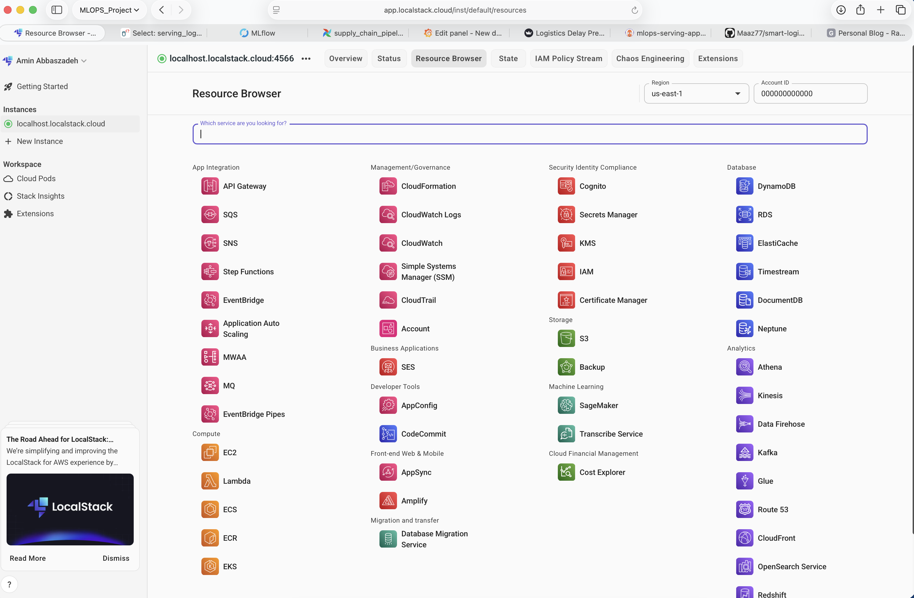
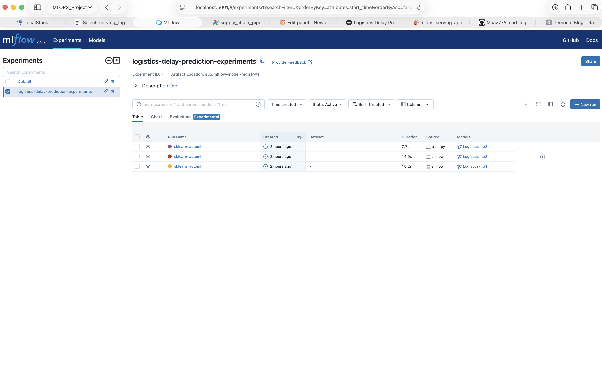
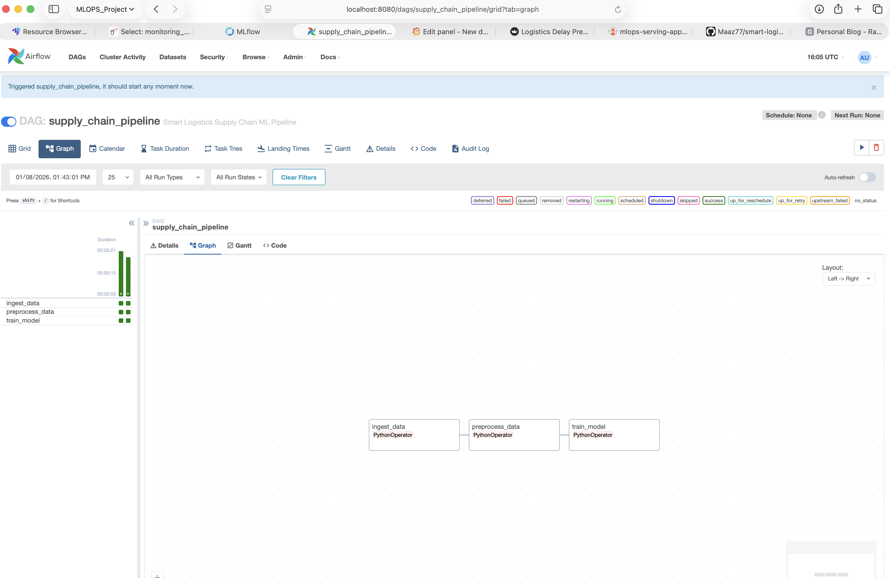
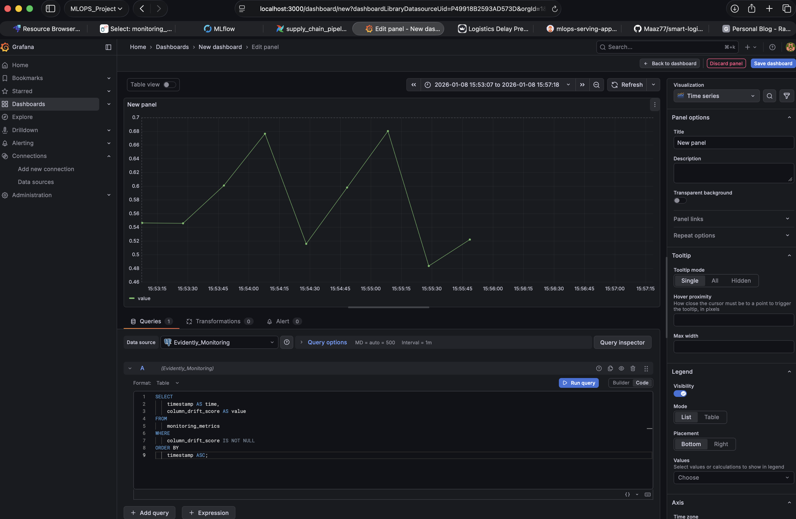
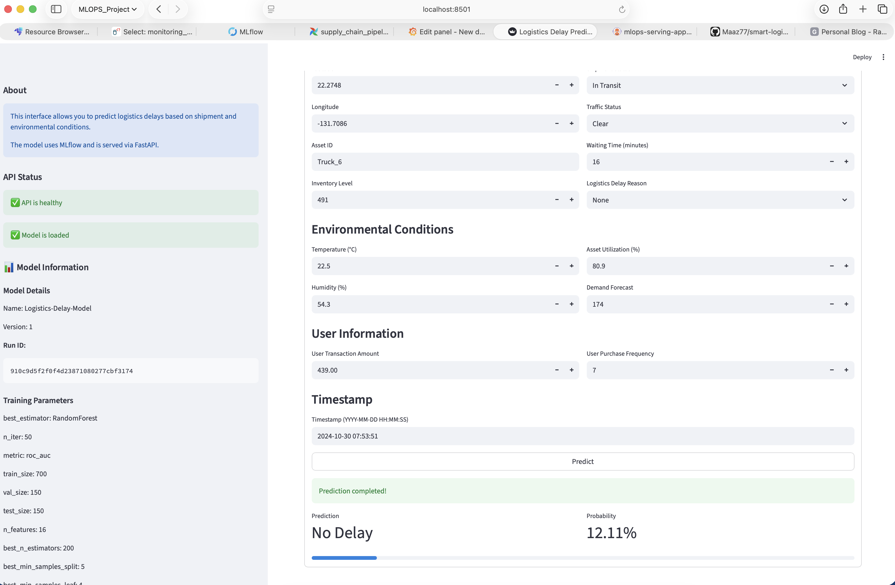
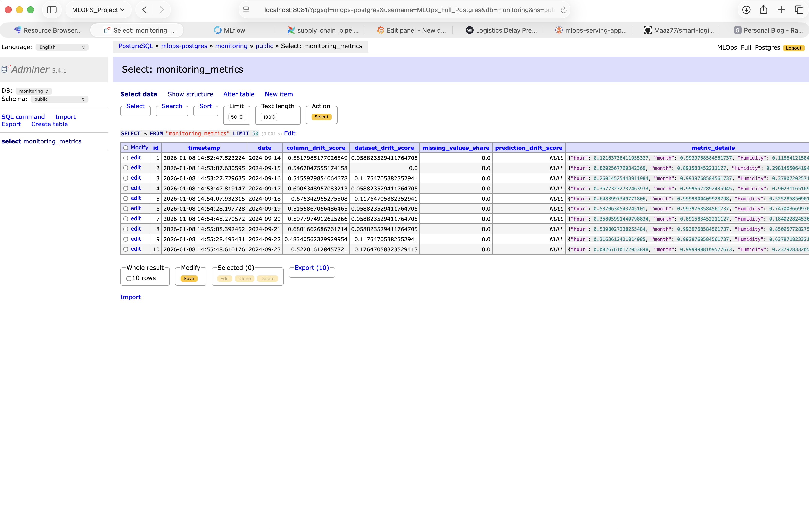

# 🚚 Smart Logistics Supply Chain Delay Prediction MLOps

> **A production-grade MLOps project** demonstrating end-to-end machine learning operations for logistics delay prediction. This project practices **MLOps** and **software engineering** best practices, implementing a complete pipeline from data ingestion to model serving with monitoring and automated deployments.

---

## 📋 Overview

This project implements a **machine learning system** for predicting logistics delays in supply chain operations. It demonstrates a production-ready MLOps workflow including experiment tracking, workflow orchestration, model serving, monitoring, and GitOps-based continuous deployment.

The project uses a **Makefile** as the primary automation tool and single source of truth for project commands, ensuring consistency across local development and CI/CD workflows.

### 🛠️ Technologies & Skills Practiced

- **Infrastructure as Code** (Terraform, LocalStack, AWS S3)
- **Experiment Tracking & Model Registry** (MLflow)
- **Workflow Orchestration** (Airflow)
- **Model Monitoring** (Evidently, Grafana)
- **API Development** (FastAPI, Streamlit)
- **Container Orchestration** (Kubernetes)
- **GitOps** (ArgoCD)
- **CI/CD Pipelines** (GitHub Actions)
- **Data Version Control** (DVC)
- **Code Quality** (pre-commit hooks, pytest, mypy, ruff)

---

## 🏗️ Technology Stack

### ☁️ Infrastructure & Cloud

#### **LocalStack + AWS + Terraform + S3 Buckets**

- **LocalStack** emulates AWS services locally for development and testing
- **Terraform** provisions S3 buckets (`smart-logistics-data`, `mlflow-model-registry`) as Infrastructure as Code
- **S3 Buckets** store raw/processed data and MLflow artifacts with bidirectional sync to local folders
- Enables cloud-native development patterns without AWS costs



---

### 📊 Experiment Tracking & Model Registry

#### **MLflow**

- Tracks experiments, parameters, and metrics during model training
- Model Registry manages model versions with aliases (`production`, `staging`)
- Artifacts stored in S3-compatible storage (LocalStack)
- PostgreSQL backend for experiment metadata
- Enables model versioning, comparison, and production promotion workflows



---

### 🔄 Workflow Orchestration

#### **Airflow**

- Orchestrates ML pipeline: data ingestion → preprocessing → training
- DAG-based workflow management with task dependencies
- LocalExecutor for sequential task execution
- Metadata stored in PostgreSQL
- Enables scheduled and event-driven pipeline execution



---

### 🧪 Testing

#### **pytest**

- Unit tests for pipeline components and utilities
- Integration tests for serving API and UI
- Test coverage reporting with pytest-cov
- Mock-based testing for external dependencies
- Ensures code reliability and regression prevention

---

### 📈 Model Monitoring

#### **Evidently**

- Calculates data drift metrics (column drift, dataset drift, prediction drift)
- Detects distribution shifts between training and production data
- Missing values analysis and statistical drift detection
- Metrics logged to PostgreSQL for time-series analysis

#### **Grafana**

- Visualizes monitoring metrics with custom dashboards
- PostgreSQL datasource for querying drift metrics
- Time-series visualizations for drift trends
- Enables proactive model performance monitoring



---

### 🚀 Model Serving

#### **FastAPI**

- RESTful API for model predictions with automatic OpenAPI documentation
- Loads models from MLflow registry using configurable aliases
- Request/response logging to PostgreSQL (`serving_logs` table)
- Health checks and model metadata endpoints
- Production-ready async API with Pydantic validation

#### **Streamlit**

- Interactive UI for model predictions
- User-friendly form-based input
- Real-time prediction visualization
- Connects to FastAPI backend for inference



---

### ☸️ Container Orchestration

#### **Kubernetes (Kind)**

- Local Kubernetes cluster for container orchestration
- Deploys serving API and UI as containerized microservices
- ConfigMaps for model configuration (model name, alias)
- Service discovery and load balancing
- Health checks and resource management

---

### 🔁 GitOps

#### **ArgoCD**

- GitOps-based continuous deployment
- Monitors Git repository for Kubernetes manifest changes
- Automatic synchronization when deployment YAMLs are updated
- Self-healing capabilities to maintain desired state
- Enables declarative infrastructure management


---

### 🔄 CI/CD

#### **GitHub Actions**

All CI workflows use the **Makefile** as a single source of truth, ensuring consistency between local development and automated pipelines.

**Continuous Integration (CI):**
- ✅ Quality checks: type checking (mypy), code formatting (ruff), linting
- ✅ Automated testing: unit tests, integration tests
- ✅ Infrastructure validation: LocalStack, Terraform, service health checks
- ✅ Conditional Docker image building: builds multi-arch images (amd64, arm64) only when app code changes
- ✅ Image tagging: uses commit SHA for versioning

**Continuous Deployment (CD):**
- 🚀 Automatic deployment trigger: runs after successful CI on `master` branch
- 🔍 Change detection: identifies changes in `src/` or `serving/` directories
- 📝 Manifest updates: automatically updates Kubernetes deployment YAMLs with new image tags
- 💾 Git commit: commits updated manifests back to repository
- 🔄 ArgoCD sync: ArgoCD detects Git changes and automatically deploys to Kubernetes

**Model Alias Changes:**
- When `MODEL_ALIAS` environment variable is updated in `k8s/apps/api-deployment.yaml`, ArgoCD detects the change
- ArgoCD automatically syncs the updated configuration to Kubernetes
- API pods restart with new model alias, loading the corresponding model version from MLflow registry
- No manual deployment steps required—fully automated via GitOps

---

### 📦 Data Version Control

#### **DVC**

- Version controls large data files (CSV, Parquet) stored in S3
- Tracks data lineage and enables data reproducibility
- `.dvc` files store metadata while actual data remains in S3
- Enables data pipeline versioning alongside code

---

### ✨ Code Quality

#### **Pre-commit Hooks**

- Automated code quality checks before commits
- Runs ruff (linting, formatting), mypy (type checking)
- Validates YAML, JSON, Terraform files
- Prevents committing code with style issues or syntax errors
- Enforces consistent code standards across the project

---

## 🚀 Getting Started

### Prerequisites

- **Poetry**: `curl -sSL https://install.python-poetry.org | python3 -`
- **pyenv**: `brew install pyenv` (macOS) or [install guide](https://github.com/pyenv/pyenv#installation)
- **Docker** & **Docker Compose**
- **kubectl** & **Kind** (for Kubernetes)

### Setup

1. **Install dependencies:**
   ```bash
   make setup
   ```

2. **Start infrastructure:**
   ```bash
   make infra-up          # LocalStack, Terraform, S3 buckets
   make ml-services-up    # PostgreSQL, MLflow, Airflow
   ```

3. **Run ML pipeline:**
   ```bash
   make pipeline          # Ingest → Preprocess → Train
   ```

4. **Start monitoring:**
   ```bash
   make grafana-up        # Grafana dashboard
   make monitoring        # Run monitoring simulation
   ```

5. **Deploy to Kubernetes:**
   ```bash
   make setup-k8s         # Creates Kind cluster, installs ArgoCD
   # Access hints printed after setup
   ```

### 🌐 Service URLs

| Service | URL | Credentials |
|---------|-----|-------------|
| **MLflow UI** | http://localhost:5001 | - |
| **Airflow UI** | http://localhost:8080 | admin/admin |
| **Grafana** | http://localhost:3000 | admin/admin |
| **Adminer** | http://localhost:8081 | - |
| **ArgoCD UI** | https://localhost:8088 | (see `make argocd-password`) |
| **Application UI** | http://localhost:8501 | (after port-forward) |

---

## 📖 Usage Guide

### Running the ML Pipeline

The pipeline can be executed via **Makefile** or **Airflow**:

**Via Makefile:**
```bash
make pipeline
```

**Via Airflow:**
1. Access Airflow UI at http://localhost:8080
2. Trigger the `supply_chain_pipeline` DAG
3. Monitor task execution in the Airflow UI

### Model Training & Registry

1. **Train models**: `make pipeline` (registers models in MLflow)
2. **View experiments**: http://localhost:5001
3. **Promote to production**: Assign `production` alias in MLflow UI
4. Models are versioned and stored in S3

### Model Monitoring

1. **Start monitoring**: `make monitoring`
2. **View dashboards**: http://localhost:3000
3. **Metrics include**:
   - Column drift scores
   - Dataset drift
   - Prediction drift
   - Missing values share

### Kubernetes Deployment

1. **Setup cluster**: `make setup-k8s`
2. **ArgoCD automatically syncs** from Git
3. **Access ArgoCD**: Port forward and login (password from `make argocd-password`)
4. **Access application**: Port forward services (hints printed after `make setup-k8s`)

### Changing Model Versions

To deploy a different model version:
1. Update `MODEL_ALIAS` in `k8s/apps/api-deployment.yaml`
2. Commit and push to Git
3. ArgoCD detects change and automatically redeploys
4. API pods restart with new model alias

---

## 🔄 CI/CD Pipeline

### Continuous Integration

On every push to `master`:
1. **Quality Checks**: Type checking, linting, formatting
2. **Testing**: Unit and integration tests
3. **Infrastructure Tests**: Validates LocalStack, Terraform, services
4. **Image Building**: Builds Docker images (only if `src/` or `serving/` changed)
   - Multi-arch images (linux/amd64, linux/arm64)
   - Tagged with commit SHA
   - Pushed to Docker Hub

### Continuous Deployment

After successful CI:
1. **Change Detection**: Identifies app code changes
2. **Manifest Update**: Updates Kubernetes deployment YAMLs with new image tags
3. **Git Commit**: Commits updated manifests to repository
4. **ArgoCD Sync**: ArgoCD automatically detects Git changes and deploys

**Deployment Triggers:**
- Changes to `src/` or `serving/` directories → Builds new images → Updates manifests → ArgoCD deploys
- Changes to `MODEL_ALIAS` in deployment YAML → ArgoCD detects → Redeploys with new model

---

## 🗄️ Database Architecture

Unified PostgreSQL container hosts **four databases**:
- **mlflow**: Experiment tracking metadata
- **airflow**: Workflow orchestration metadata
- **monitoring**: Evidently metrics (`monitoring_metrics` table)
- **serving**: API request logs (`serving_logs` table)

All databases persist in `mlops_services/postgres_data/`.



---
